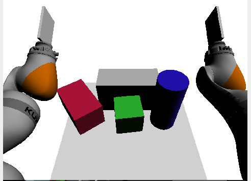
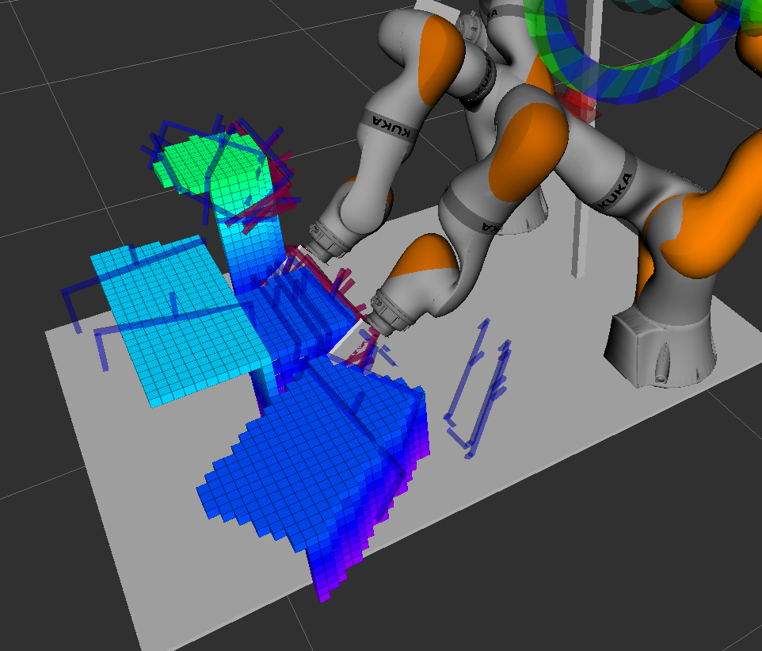

### Grasp Planner

Performs planning of robot trajectories that will lead to a stable grasp of an object with both arms.

### Description

Taken as input an RGBD frame from an overhead camera, the module will compute a list of candidate grasps using a neural network (GraspNet). Candidate grasps consist of position and orientation of a virtual gripper (parallel plate gripper). From these we may obtain candidate poses of the end effectors of the two robots. The poses are filtered using inverse kinematics (only reachable non-colliding poses are retained). For the remaing poses dual arm motion planning is perfomed using MoveIt2.

Scene           |  Grasp result
:-------------------------:|:-------------------------:
  |  

### Functionality

The module exposes a ROS2 service that when called will connect with the RGBD camera subscribe to color and depth image topics and grab images, process them and produce a list of plausible motion plans (ranked by manipulability score) or an error code if an error occurs or no grasps are found. As a prerequisite thus the service will need a running RGBD camera publishing to known topics as well as the transform from the world coordinate frame to the camera optical frame (camera external calibration).

### Technical Specifications

- C++, CUDA

- CUDA (Tested on CUDA 11.8)

- CUDA GPU enabled hardware (tested on NVidia GForce RTX 3060, GTX 1070)

### Design

### Use Cases

### Testing
Preliminary testing has so far been performed using a virtual camera (rendering a 3D mesh scene)

### Limitations

